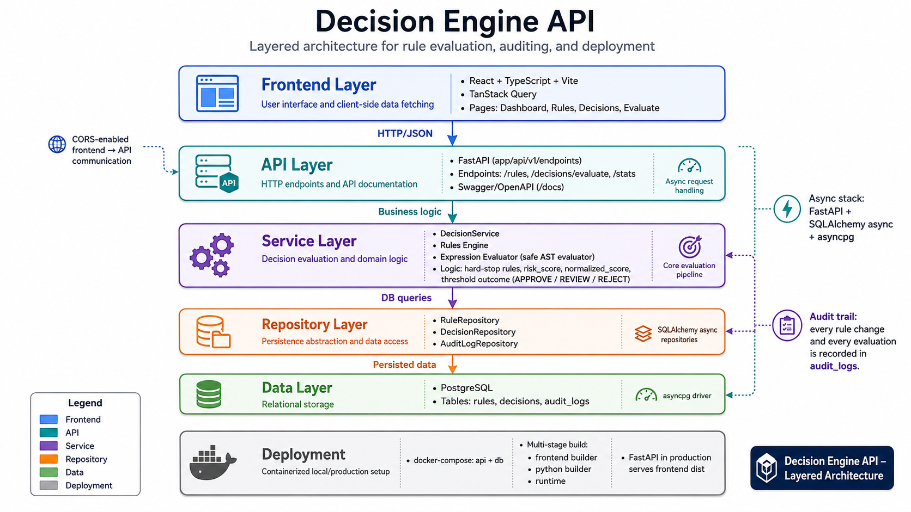
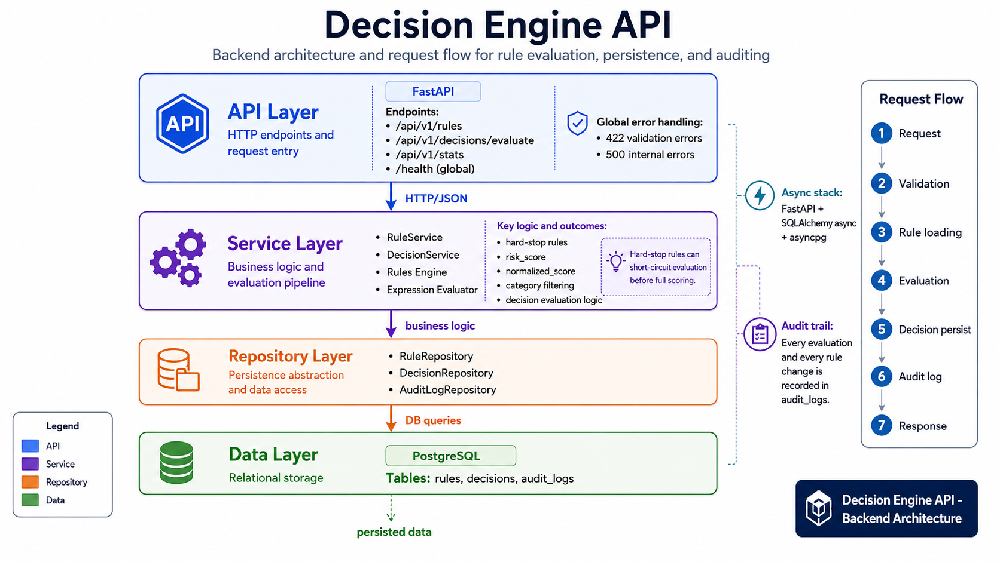

# Decision Engine API


A rule-based decision platform built with FastAPI, PostgreSQL, and React for evaluating arbitrary JSON payloads and returning auditable APPROVE, REVIEW, or REJECT outcomes.

## Architecture Visuals

### System Architecture



### Backend Architecture and Flow



## Highlights

- Layered backend architecture (API, Service, Repository, Data)
- Configurable rules with DSL and legacy field/operator/value support
- Hard-stop rule handling with weighted risk scoring and normalized score
- Immutable audit logging for rule changes and decision evaluations
- Async stack: FastAPI + SQLAlchemy async + asyncpg
- React dashboard for rules, decisions, and payload evaluation
- Dockerized deployment with PostgreSQL via Compose

## Quick Start

### Local Development

```bash
python -m venv venv
venv\Scripts\activate
pip install -r requirements.txt
uvicorn app.main:app --reload
```

```bash
cd frontend
npm install
npm run dev
```

### Docker

```bash
docker compose up --build
```

## Try It In 60 Seconds

Run these commands after the API is up on `http://localhost:8000`.

### 1) Create a demo rule

```bash
curl -X POST http://localhost:8000/api/v1/rules/ \
	-H "Content-Type: application/json" \
	-d "{\"name\":\"high_amount_demo\",\"field\":\"amount\",\"operator\":\"gt\",\"value\":10000,\"action\":\"REVIEW\",\"priority\":10,\"weight\":30,\"category\":\"fraud\"}"
```

### 2) Evaluate a payload

```bash
curl -X POST http://localhost:8000/api/v1/decisions/evaluate \
	-H "Content-Type: application/json" \
	-d "{\"payload\":{\"amount\":15000,\"country\":\"NG\"},\"reference_id\":\"demo-1\",\"category\":\"fraud\"}"
```

### 3) Check health

```bash
curl http://localhost:8000/health
```

## Project Docs

Detailed documentation is maintained in [docs/INDEX.md](docs/INDEX.md).

- Setup and run guide: [docs/01-quick-start.md](docs/01-quick-start.md)
- Architecture notes: [docs/02-architecture.md](docs/02-architecture.md)
- Backend internals: [docs/03-backend.md](docs/03-backend.md)
- Rules engine logic: [docs/04-rules-engine.md](docs/04-rules-engine.md)
- API reference: [docs/05-api-reference.md](docs/05-api-reference.md)
- Frontend: [docs/06-frontend.md](docs/06-frontend.md)
- Database and migrations: [docs/07-database-and-migrations.md](docs/07-database-and-migrations.md)
- Docker and deployment: [docs/08-docker-and-deployment.md](docs/08-docker-and-deployment.md)
- Troubleshooting: [docs/09-troubleshooting.md](docs/09-troubleshooting.md)

## Repository Structure

```text
app/          FastAPI backend (API, services, repositories, models)
frontend/     React + Vite dashboard
docs/         Technical documentation
migrations/   SQL migration scripts
```
